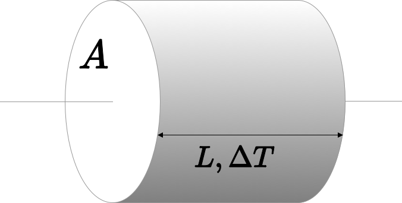
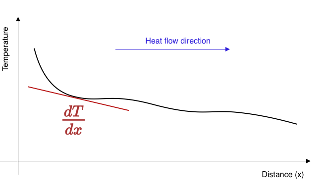
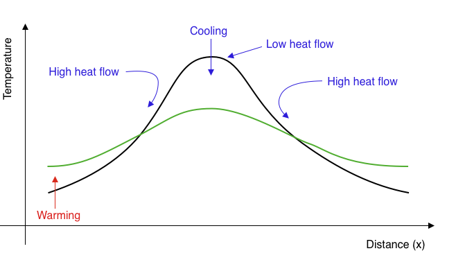
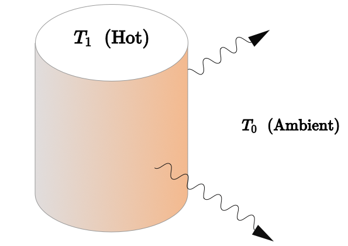

# EMSC 2022

## Mantle convection and plate motions

  - Louis Moresi, Australian National University

 <!-- .element style="float: right; width:30%" -->

 

*In which we shall examine the nature of convection as a phenomenon that transfers heat and generates motion. We will see how we can extract a single number that tells us almost everything about how / whether convection takes place … and we will calculate this for the Earth’s mantle.*

<--o-->

## Mantle Convection

Convection in Earth’s interior is (a little bit) like a boiling pot (as we saw in a previous lecture)

  <!-- .element style="height:300px" -->
             <!-- .element style="height:300px" -->

The hot soup rises to the surface, spreads and begins to cool, and then sinks back to the bottom of the pot where it is reheated and rises again. **Why does hot soup rise and cold soup sink** ?

<--o-->

## General Observations on Convection

Without being particularly quantitative:

  - Hot liquid is more buoyant than cold material **and it tends to rise**
  - Cooler liquid is less buoyant and **therefore tends to sink**
  - This can only happen if the two can **move past each other**
  - Convection produces a self-stirring

  <!-- .element style="float:right; width:25%" -->

Buoyancy forces are at work and viscous forces counteract these forces once the fluid is moving

$$
\textrm{buoyancy} \propto g \rho_0 \alpha(1-\Delta T)
$$ 

Convection like this will only work when the soup is heated from below or, in the case of the Earth, if it is heated from within by radioactivity. **( Can you see why ?)**

<--o-->

## General Observations on Convection

**Definition**:  Convection is the transfer of heat by the self-organised movement of a fluid. Free convection is when the fluid is stirred entirely by rising buoyant material and sinking negatively-buoyant material. (Forced convection is produced when the fluid is stirred mechanically).

<video autoplay controls width="33%">
    <source src="images/LavaLampNormalSpeed.m4v"
            type="video/mp4">

    Sorry, your browser doesn't support embedded videos.
</video>

Convection is one of the ways we transfer heat from hot regions deep in the Earth to cooler, shallow regions. 

<--o-->

## Heat Transfer 

 <!-- .element style="height:250px; float:right;" -->

Other ways that heat can be transferred include *radiation*, *advection*, and *conduction*. 

**Advection** of heat is where some object carries an excess (or defecit of) heat energy from place to place. 

**Conduction** is the transfer of heat (or electric current) from one substance to another by direct contact (lattice vibrations / electrons). 

**Radiation** is the transfer of heat energy by photons that pass between two materials. It does not require any physical contact or indermediary material (e.g. it is not a problem to transfer heat across a vacuum this way).

<--o-->

## Conduction & Fourier's Law

 <!-- .element style="height:200px; float:right" -->

**Fourier's Law** tells us how much heat, $Q$ is conducted through a sample in a unit time

$$
  Q=-\frac{k A \Delta T}{L} 
$$

 

$A$ is the cross sectional area of the sample, $L$is its length, $k$is a thermal conductivity “constant” dependent on the nature of the material and often also on the temperature, and $\Delta T$ is the temperature difference across the sample. (Note the minus sign because heat will always flow from a higher temperature to a lower temperature.)

note: We could add an "advanced" slide here to explain the differential equation version

<--o-->

## Conduction & Fourier's Law 

**Fourier's Law** is explained using a simple thought experiment such as this one but it actually refers to the fact that heat
flows *down a temperature gradient*. 

 <!-- .element style="height:300px; float:right" -->

$$ q = - k \frac{dT}{dx} $$ 

$q, (W/m^2)$ is called the heat flux and measures the flow of heat per unit area perpendicular to the temperature gradient

<--o-->

## Thermal diffusion & Fourier's Law 

If the heat flux into a region is not balanced by the heat flux out, the region must change temperature. For example, if more heat flow into a region than is flowing out, it will become warmer. 

 <!-- .element style="height:300px; float:right" -->

This process reduces the amplitude of temperature variations over time and makes the temperature smoother. 

The heat flow in the diagram is away in both directions from the high temperature to the cooler areas. The loss of heat from this region is balanced by a reduced temperature. 

Temperature extremes become smaller, gradients become lower, the heat flux everywhere becomes
smaller: the temperature differences *decay* through time. 

<--v-->

## Newton's Law of Cooling (advanced)

Another example of "thermal decay" occurs when we have a hot body in a cool environment loosing heat through its surface according to the Fourier Law. 

 <!-- .element style="height:300px; float:right" -->

The heat flux is proportional to the difference in temperature between the hot object and the surroundings, so

$$
  \frac{dT}{dt} \propto T - T_0  \quad \rightarrow \quad T = T_1 e^{-\lambda t}
$$

This is exactly the same equation for the anomalous temperature as for the quantity of a radioactive isotope remaining after a certain time and has the same solution with $\lambda$ a constant for a particular experiment.  

<--v-->

## Thermal diffusion (advanced)

If a region has a different heat flux in v. out, then there must be a gradient in the heat flux. A change in temperature is driven by gradients in the heat flux like this:

$$
   \frac{\partial T}{\partial t} =  -\frac{k}{\rho C_p} \frac{\partial q}{\partial x} + H
$$

$H$ is internal heat generation which is often important in the Earth because of the decay of radioactive isotopes.  Now we substitute for $q$ from Fourier's Law and have this expression:

$$
   \frac{\partial T}{\partial t} =  -\frac{k}{\rho C_p} \frac{\partial^2 T}{\partial x^2} + H
$$

Fourier was one of the first to solve this mathematically and developed his method of summing harmonics (series solutions) along the way. 

<--o-->

## Convection and the Mantle

 <!-- .element style="height:300px; float:right" -->

The soup analogy is quite helpful because it demonstrateshow heat escaping from the interior of the planet can do mechanical work (a.k.a. a heat engine). 

This heat engine is the driving force behind tectonic motion and the constructive side of of the geological cycle.

**Key differences**

  - The Earth’s mantle is solid, the soup is liquid / a slurry.
  - The soup does not show any evidence of plate tectonics.
  - Hot and cold rocks have quite different physical properties (e.g. viscosity, elastic strength) even if they don’t melt.

<--v-->

Todo: Add discussion points

    - (How do we know that the mantle is solid*?)
    - (When does a solid act like a viscous fluid†  ?)

* Hint: how do we know that the outer core is not solid ? 

† If you are interested, read about crystal defects and deformation

<--o-->

## Resources

  <!-- .element style="float: right" width="25%" -->

  [Online book](https://anu-rses-education.github.io/EMSC-3002/FrontPage.html)
with lecture materials, practicals and live computational examples.

  Wattle (when available), Programs and Courses  

  [Source code](https://github.com/underworld-geodynamics-cloud/self-managing-jupyterhub)

 

<--o-->

