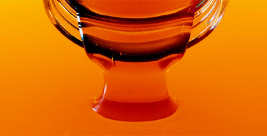
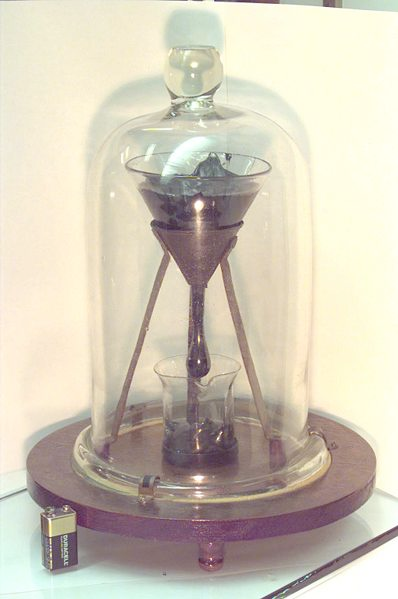
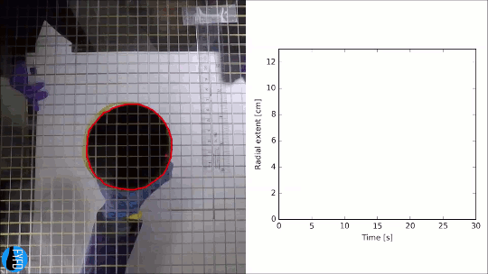
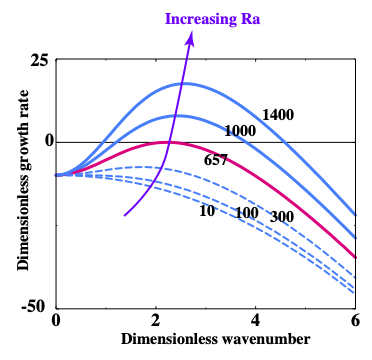

# EMSC 2022

## Mantle convection and plate motions

  - Louis Moresi, Australian National University

 <!-- .element style="float: right; width:30%" -->

 

*In which we shall examine the nature of convection as a phenomenon that transfers heat and generates motion. We will see how we can extract a single number that tells us almost everything about how / whether convection takes place … and we will calculate this for the Earth’s mantle.*

<--o-->  

## Mantle Convection

Convection in Earth’s interior is (a little bit) like a boiling pot (as we saw in a previous lecture)

  <!-- .element style="height:300px" -->
             <!-- .element style="height:300px" -->

The hot soup rises to the surface, spreads and begins to cool, and then sinks back to the bottom of the pot where it is reheated and rises again. **Why does hot soup rise and cold soup sink** ?

<--o-->  

## General Observations on Convection

Without being particularly quantitative:

  - Hot liquid is more buoyant than cold material **and it tends to rise**
  - Cooler liquid is less buoyant and **therefore tends to sink**
  - This can only happen if the two can **move past each other**
  - Convection produces a self-stirring

  <!-- .element style="float:right; width:25%" -->

Buoyancy forces are at work and viscous forces counteract these forces once the fluid is moving

$$
\textrm{buoyancy} \propto g \rho_0 \alpha(1-\Delta T)
$$ 

Convection like this will only work when the soup is heated from below or, in the case of the Earth, if it is heated from within by radioactivity. **( Can you see why ?)**

<--o-->  

## General Observations on Convection

**Definition**:  Convection is the transfer of heat by the self-organised movement of a fluid. Free convection is when the fluid is stirred entirely by rising buoyant material and sinking negatively-buoyant material. (Forced convection is produced when the fluid is stirred mechanically).

<video autoplay controls width="33%">
    <source src="movies/LavaLampNormalSpeed.m4v"
            type="video/mp4">

    Sorry, your browser doesn't support embedded videos.
</video>

Convection is one of the ways we transfer heat from hot regions deep in the Earth to cooler, shallow regions. 

<--o-->  

## Heat Transfer 

 <!-- .element style="height:250px; float:right;" -->

Other ways that heat can be transferred include *radiation*, *advection*, and *conduction*. 

**Advection** of heat is where some object carries an excess (or defecit of) heat energy from place to place. 

**Conduction** is the transfer of heat (or electric current) from one substance to another by direct contact (lattice vibrations / electrons). 

**Radiation** is the transfer of heat energy by photons that pass between two materials. It does not require any physical contact or indermediary material (e.g. it is not a problem to transfer heat across a vacuum this way).

<--o-->

## Conduction & Fourier's Law

 <!-- .element style="height:200px; float:right" -->

**Fourier's Law** tells us how much heat, $Q$ is conducted through a sample in a unit time

$$
  Q=-\frac{k A \Delta T}{L} 
$$

 

$A$ is the cross sectional area of the sample, $L$ is its length, $k$ is a thermal conductivity “constant” dependent on the nature of the material and often also on the temperature, and $\Delta T$ is the temperature difference across the sample. (Note the minus sign because heat will always flow from a higher temperature to a lower temperature.)

note: We could add an "advanced" slide here to explain the differential equation version

<--o-->

## Conduction & Fourier's Law 

**Fourier's Law** is explained using a simple thought experiment such as this one but it actually refers to the fact that heat
flows *down a temperature gradient*. 

 <!-- .element style="height:300px; float:right" -->

$$ q = - k \frac{dT}{dx} $$ 

$q, (W/m^2)$ is called the heat flux and measures the flow of heat per unit area perpendicular to the temperature gradient

<--o-->

## Thermal diffusion & Fourier's Law 

If the heat flux into a region is not balanced by the heat flux out, the region must change temperature. For example, if more heat flow into a region than is flowing out, it will become warmer. 

 <!-- .element style="height:300px; float:right" -->

This process reduces the amplitude of temperature variations over time and makes the temperature smoother. 

The heat flow in the diagram is away in both directions from the high temperature to the cooler areas. The loss of heat from this region is balanced by a reduced temperature. 

Temperature extremes become smaller, gradients become lower, the heat flux everywhere becomes
smaller: the temperature differences *decay* through time. 

<--v-->

## Newton's Law of Cooling (advanced)

Another example of "thermal decay" occurs when we have a hot body in a cool environment loosing heat through its surface according to the Fourier Law. 

 <!-- .element style="height:300px; float:right" -->

The heat flux is proportional to the difference in temperature between the hot object and the surroundings, so

$$
  \frac{dT}{dt} \propto T - T_0  \quad \rightarrow \quad T = T_1 e^{-\lambda t}
$$

This is exactly the same equation for the anomalous temperature as for the quantity of a radioactive isotope remaining after a certain time and has the same solution with $\lambda$ a constant for a particular experiment.  

<--v-->

## Thermal diffusion (advanced)

If a region has a different heat flux in v. out, then there must be a gradient in the heat flux. A change in temperature is driven by gradients in the heat flux like this:

$$
   \frac{\partial T}{\partial t} =  \frac{k}{\rho C_p} \frac{\partial q}{\partial x} + H
$$

$H$ is internal heat generation which is often important in the Earth because of the decay of radioactive isotopes.  Now we substitute for $q$ from Fourier's Law and have this expression:

$$
   \frac{\partial T}{\partial t} =  \frac{k}{\rho C_p} \frac{\partial^2 T}{\partial x^2} + H
$$

Fourier was one of the first to solve this mathematically and developed his method of summing harmonics (series solutions) along the way. 

<--o-->

## Convection and the Mantle

 <!-- .element style="height:300px; float:right" -->

The soup analogy is quite helpful because it demonstrateshow heat escaping from the interior of the planet can do mechanical work (a.k.a. a heat engine). 

This heat engine is the driving force behind tectonic motion and the constructive side of of the geological cycle.

**Key differences**

  - The Earth’s mantle is solid, the soup is liquid / a slurry.
  - The soup does not show any evidence of plate tectonics.
  - Hot and cold rocks have quite different physical properties (e.g. viscosity, elastic strength) even if they don’t melt.

<--o-->

## Lava Lakes

There are some hints at plate-like surface motions in caldera lava lakes like this one from the USGS

<iframe width="560" height="315" src="https://www.youtube.com/embed/ybMekPyvq9Y?start=10" title="YouTube video player" frameborder="0" allow="accelerometer; autoplay; clipboard-write; encrypted-media; gyroscope; picture-in-picture" allowfullscreen></iframe>

*April 17, 2021: The lava lake in Halema‘uma‘u Crater, at the summit of Kīlauea Volcano, remains active. This video is shown at 20x speed and shows the lava supplying the lake from the western fissure.*

<--v-->

## Lava Lakes

This shows the foundering of the cooler crust of the lake into the interior. New solid crust forms where the molten lava meets the atmosphere.

<iframe width="560" height="315" src="https://www.youtube.com/embed/moWrOrPvaV0?start=10" title="YouTube video player" frameborder="0" allow="accelerometer; autoplay; clipboard-write; encrypted-media; gyroscope; picture-in-picture" allowfullscreen></iframe>

*This video shows crustal foundering and resurfacing at the lava lake in Halema‘uma‘u, at the summit of Kīlauea on January 8, 2021. Recently this foundering process has been common in the eastern portion of the lake. The video is shown at 20x speed.*

<--o-->

## Discussion points

**What have we learned so far ?** 

If the Earth really follows this cartoon, we need to understand how solid rock can deform as though it was a viscous liquid. 

 <!-- .element style="width:25%; float:right" -->

  - How do we know that the mantle is solid (*) ?

  - When/how does a solid act like a viscous fluid (†)  ?

  - What is the typical speed of viscous flow in the mantle ?

  - How much energy is the Earth using up for plate tectonics ?

**(*)**:  How do we know that the outer core is not solid ? 

**(†)**: If you are interested, read about crystal defects and deformation

<--o-->

## A Toy Model

<video autoplay controls height="315">
    <source src="movies/ReferenceSinker.mp4"
            type="video/mp4">

    Sorry, your browser doesn't support embedded videos.
</video>

Imagine a tank of **thick, viscous fluid** (like syrup, for example). This turns out to be a reasonable model for the interior of a solid (rocky / icy) planet if we consider the evolution on a geological timescale. A cold / dense blob of material sinks and stirs a tank of fluid just like this computer model shows.

<--o-->

## What is viscosity ?

  <!-- .element style="height:250px;" -->
 <!-- .element style="height:250px;" -->

**Viscosity** is a measure of the resistance of a fluid to deform under shear stress. It is commonly perceived as "thickness", or resistance to flow. Viscosity describes a fluid's internal resistance to flow and may be thought of as a measure of fluid friction. Water is runny, having a lower viscosity, while honey is "thick" having a higher viscosity.

*The right image is from the University of Queensland [Pitch Drop Experiment](https://smp.uq.edu.au/pitch-drop-experiment)*

<--v-->

## What is viscosity ?

 <!-- .element style="width:35%; float:right; padding-left:30px; " -->

Viscous deformation is an irreversible *flow* that occurs in response to an applied shear stress. 
The stress is found to depend on the strength of the shearing *velocity gradient*.

$$
  \tau = \eta \frac{d v_1}{d x_2} 
$$  
<!-- .element style="width:60%;" -->

 <!-- .element style="width:35%; float:right; padding-left:30px;" -->

Think of this as the stress that resists the shear deformation, i.e. how hard it is to stir the fluid. This is much harder if the fluid is **more viscous**. 
Or think of it as how fast the fluid responds to a given force (e.g. gravity) so a viscous gravity current will spread **more slowly** if the viscosity is high.

Viscosity only opposes the formation of velocity gradients; not a driving force, only a resistance.

<--o-->

## A Toy Model

<video autoplay controls loop height="315">
    <source src="movies/ReferenceSinker.mp4"
            type="video/mp4">

    Sorry, your browser doesn't support embedded videos.
</video>

<video autoplay controls loop height="315">
    <source src="movies/ReferenceFloater.mp4"
            type="video/mp4">

    Sorry, your browser doesn't support embedded videos.
</video>

In this toy model, do hot blobs and cold blobs behave in the same way 
(other than moving up v. moving down ?)

<--o-->

## A Toy Model

<video autoplay controls loop height="315">
    <source src="movies/ReferenceSinker.mp4"
            type="video/mp4">

    Sorry, your browser doesn't support embedded videos.
</video>

Now let us think about how the physical properties of the fluid and the boundary conditions change how this blob behaves.  

$$ \textrm{Activity} = \frac{\textrm{Whatever tends to enhance the flow}}{\textrm{Whatever tends to retard the flow}} $$

We will consider how the behaviour changes with various parameters. When we change a parameter does it tend to enhance flow or retard it ?

<--o-->

## Buoyancy forces

$$ \mathrm{buoyancy} \propto g\rho_0\alpha\left(1-\Delta T\right) $$  <!-- .element style="width:40%" -->

<video autoplay controls loop height="315">
    <source src="movies/LessBuoyantSinker.mp4"
            type="video/mp4">

    Sorry, your browser doesn't support embedded videos.
</video>
<video autoplay controls loop height="315">
    <source src="movies/ReferenceSinker.mp4"
            type="video/mp4">

    Sorry, your browser doesn't support embedded videos.
</video>
<video autoplay controls loop height="315">
    <source src="movies/MoreBuoyantSinker.mp4"
            type="video/mp4">

    Sorry, your browser doesn't support embedded videos.
</video>

Lower strength of buoyancy forces on the left, increasing towards the right. 

Does *buoyancy* drive the flow harder when it is a stronger effect ?

<--v-->

<!-- Kahoot link ! -->

 <!-- .element style="width:75%;" -->

<--v-->

<iframe width="900" height="600" src="https://play.kahoot.it/v2/?quizId=76e2efc5-de8a-4638-8369-d42722b30f26" frameborder="0" allowfullscreen>
</iframe> 

<--o-->

## Viscous drag

<video autoplay controls loop height="315">
    <source src="movies/LessViscousSinker.mp4"
            type="video/mp4">

    Sorry, your browser doesn't support embedded videos.
</video>
<video autoplay controls loop height="315">
    <source src="movies/ReferenceSinker.mp4"
            type="video/mp4">

    Sorry, your browser doesn't support embedded videos.
</video>
<video autoplay controls loop height="315">
    <source src="movies/MoreViscousSinker.mp4"
            type="video/mp4">

    Sorry, your browser doesn't support embedded videos.
</video>

Lower viscous drag stresses on the left, increasing towards the right. 

Does *viscous drag* drive the flow harder when it is a stronger effect ?

<--v-->

<!-- Kahoot link ! -->

 <!-- .element style="width:75%;" -->

<--v-->

<iframe width="900" height="600" src="https://play.kahoot.it/v2/?quizId=2cfa29b4-a28c-4257-a2ce-e9b213b80347" frameborder="0" allowfullscreen>
</iframe> 

<--o-->

## Thermal conductivity (or diffusivity)

$$
   \frac{\partial T}{\partial t} =  \color{blue}{\frac{k}{\rho C_p}} \frac{\partial^2 T}{\partial x^2} + H 
                                 =  \color{blue}{\kappa}  \frac{\partial^2 T}{\partial x^2} + H 
$$

<video autoplay controls loop height="315">
    <source src="movies/LowerThermalDiff.mp4"
            type="video/mp4">

    Sorry, your browser doesn't support embedded videos.
</video>
<video autoplay controls loop height="315">
    <source src="movies/ReferenceSinker.mp4"
            type="video/mp4">

    Sorry, your browser doesn't support embedded videos.
</video>
<video autoplay controls loop height="315">
    <source src="movies/HigherThermalDiff.mp4"
            type="video/mp4">

    Sorry, your browser doesn't support embedded videos.
</video>

Slower diffusion rates (lower diffusivity) on the left, faster towards the right. 

Does *thermal diffusivity* drive the flow harder when it is a stronger effect ?

<--v-->

<!-- Kahoot link ! -->

 <!-- .element style="width:75%;" -->

<--v-->

<iframe width="900" height="600" src="https://play.kahoot.it/v2/?quizId=a3e16838-8531-4ba4-84fd-f0f162bb0a0d" frameborder="0" allowfullscreen>
</iframe> 

<--o-->

## The Size of the Box

<video autoplay controls loop height="80">
    <source src="movies/TinyLittleBox.mp4"
            type="video/mp4">

    Sorry, your browser doesn't support embedded videos.
</video>
<video autoplay controls loop height="160">
    <source src="movies/ReferenceSinker.mp4"
            type="video/mp4">

    Sorry, your browser doesn't support embedded videos.
</video>
<video autoplay controls loop height="320">
    <source src="movies/GreatBigBox.mp4"
            type="video/mp4">

    Sorry, your browser doesn't support embedded videos.
</video>

Is the flow moving faster when the box is larger ? 

<--v-->

## The Size of the Box (Scaled to fit)

<video autoplay controls loop height="315">
    <source src="movies/TinyLittleBox.mp4"
            type="video/mp4">

    Sorry, your browser doesn't support embedded videos.
</video>
<video autoplay controls loop height="315">
    <source src="movies/ReferenceSinker.mp4"
            type="video/mp4">

    Sorry, your browser doesn't support embedded videos.
</video>
<video autoplay controls loop height="315">
    <source src="movies/GreatBigBox.mp4"
            type="video/mp4">

    Sorry, your browser doesn't support embedded videos.
</video>

Is the flow moving faster when the box is larger ? 

<--v-->

<!-- Kahoot link ! -->

 <!-- .element style="width:75%;" -->

Note: https://create.kahoot.it/my-library/kahoots/4f096a87-9e98-4262-bbfd-5e25815f0935 

<--v-->

<iframe width="900" height="600" src="https://play.kahoot.it/v2/?quizId=82abef8a-7310-4a84-a559-ae9fbd252db8" frameborder="0" allowfullscreen>
</iframe> 

<--o-->

## Convective Activity

**Intuition** from these simple toy models suggests that the vigour of convection may depend upon the various system parameters according to the following equation:

$$
\mathrm{Activity} \propto \frac{\textrm{buoyancy} \times d}{\kappa \eta}
$$

This turns out to be roughly correct, but there is an actual relationship that looks like this (with buoyancy highlighted in blue)

$$
\mathrm{Activity} \propto \frac{\color{blue}{g\rho_0\alpha\Delta T} d^3}{\kappa \eta}
$$

One reason we know the latter to be the valid relationship is that this quantity **has no units** and these simple ratios often end up being important *universal* descriptions of convecting systems at all scales.

<--v-->

## Dimensionless Numbers

Ratios where the units cancel are called **dimensionless numbers**. For fluid dynamics, the following numbers appear again and again 

**Rayleigh number** measures the intensity of buoyancy forces 

$$ \mathrm{Ra} = \frac{g\rho_0\alpha\Delta T d^3}{\kappa \eta} $$

**Reynolds number** measures the relative importance of inertial to viscous forces

$$ \mathrm{Re}=\frac{\rho V_0 d}{\eta} = \frac{V_0 d}{\nu}   $$

**Prandtl number** measures stress diffusion compared to thermal diffusion

$$ \mathrm{Pr} = \frac{\eta}{\rho \kappa} = \frac{\nu}{\kappa} $$ 

<--o-->

 <!-- .element style="width:33%; float:right" -->

## Thermal Convection

In very-viscous convection, only the Rayleigh number plays a role 
($\mathrm{Re}\rightarrow 0$ and $\mathrm{Pr} \rightarrow \infty$)

The structure of the flow and the pattern of the temperature field is predictable once we know the Rayleigh number but it is helpful first to develop some feeling for the patterns by seeing them.

 

*Blue  is cool, red is warm. The bottom of the box is kept hot, the top cold and the difference in temperature is $\Delta T$, the depth of the box is $d$ and so on. These numbers are set up so that the Rayleigh number is the required value. In a lab experiment, the simplest parameter to change is $\Delta T$ assuming that the material has a constant viscosity with $T$ and does not freeze, melt, burn or boil.*

<--v-->  

## Thermal Convection

Rayleigh number: $Ra=100$

<video autoplay controls loop height="500">
    <source src="movies/Ra1e2.m4v"
            type="video/mp4">
    Sorry, your browser doesn't support embedded videos.
</video>

<--v-->  

## Thermal Convection

Rayleigh number: $Ra=1,000$

<video autoplay controls loop height="500">
    <source src="movies/Ra1e3.m4v"
            type="video/mp4">
    Sorry, your browser doesn't support embedded videos.
</video>

<--v-->  

## Thermal Convection

Rayleigh number: $Ra=10,000$

<video autoplay controls loop height="500">
    <source src="movies/Ra1e4.m4v"
            type="video/mp4">
    Sorry, your browser doesn't support embedded videos.
</video>

<--v-->  

## Thermal Convection

Rayleigh number: $Ra=100,000$

<video autoplay controls loop height="500">
    <source src="movies/Ra1e5.m4v"
            type="video/mp4">
    Sorry, your browser doesn't support embedded videos.
</video>

<--v-->  

## Thermal Convection

Rayleigh number: $Ra=1,000,000$

<video autoplay controls loop height="500">
    <source src="movies/Ra1e6.m4v"
            type="video/mp4">
    Sorry, your browser doesn't support embedded videos.
</video>

<--v-->  

## Thermal Convection

Rayleigh number: $Ra=10,000,000$

<video autoplay controls loop height="500">
    <source src="movies/Ra1e7.m4v"
            type="video/mp4">
    Sorry, your browser doesn't support embedded videos.
</video>

<--o-->

## Flat Earth, Round Earth

Rayleigh number: $Ra=1,000,000$

<video autoplay controls loop height="250">
    <source src="movies/Ra1e6-4x1.m4v"
            type="video/mp4">
    Sorry, your browser doesn't support embedded videos.
</video>

The pattern is not changed much when we make the box a little wider

<--v-->

## Flat Earth, Round Earth

Rayleigh number: $Ra=1,000,000$

<video autoplay controls loop height="300">
    <source src="movies/Ra1e6-annu.mp4"
            type="video/mp4">
    Sorry, your browser doesn't support embedded videos.
</video>

Nor does it make a qualitative difference if we account for the Earth's curvature

<--o-->

## Steady State Convection

 <!-- .element style="width:33%; float:right" -->

In many of the examples, we reach a *steady state* in which the system stops changing and the movies appear to be frozen.

However, this steady state actually represents a dynamic balance between:
  - heat conduction into and out of the model at the bottom and top respectively
  - heat advection by continual rotation in the fluid that drags hot material between the two boundaries

Again, the best thing is to watch the system evolve and get a feel for what happens.

<--v-->

## Steady State Convection

Rayleigh number: $Ra=100,000$

<video autoplay controls loop height="450">
    <source src="movies/Ra1e5tr.m4v"
            type="video/mp4">
    Sorry, your browser doesn't support embedded videos.
</video>

<--v-->

## Steady State Convection

Rayleigh number: $Ra=1,000,000$

<video autoplay controls loop height="450">
    <source src="movies/Ra1e6tr.m4v"
            type="video/mp4">
    Sorry, your browser doesn't support embedded videos.
</video>

<--v-->

## Steady State Convection

Rayleigh number: $Ra=10,000,000$

<video autoplay controls loop height="450">
    <source src="movies/Ra1e7tr.m4v"
            type="video/mp4">
    Sorry, your browser doesn't support embedded videos.
</video>

<--o-->  

## Understanding Thermal Convection

 <!-- .element style="height:200px;" -->

A relatively simple pattern emerges from the competition between advection of heat by fluid flow and diffusion:

  - Convection cells that become independent
  - Boundary layers where horizontal advection balances vertical diffusion
  - Rotation in the middle of the box without much deformation

<--v-->

## Understanding Thermal Convection

 <!-- .element style="height:200px;" -->

Convection length and timescales are determined by the Rayleigh number. 

  - High $\mathrm{Ra}$ narrower boundary layers, higher temperature gradients
  - High $\mathrm{Ra}$ more likely to be time-dependent, unsteady
  - Low $\mathrm{Ra}$, convection suddenly shuts off

We will see this picture again when we consider the patterns of heat flow in the Earth's ocean floor.

<--o-->

## Average temperature

 <!-- .element style="height:450px;" -->

The temperature (velocity, stress etc) profiles vary systematically with $\mathrm{Ra}$.

<--v-->

 <!-- .element style="width:100%; " -->
 <!-- .element style="width:100%;" -->

## Nusselt number

Another, independent, dimensionless quantity can be derived for the convecting system and it is called the *Nusslet number*. 

$$ \mathrm{Nu} = \frac{Q d}{k \Delta T} $$

Which is the ratio of the heat transported in the convection model ($Q$) compared to what would be transported if
only conduction were at work. It turns out that

$$ \mathrm{Nu} \propto \mathrm{Ra}^{1/3} $$

*The results (right) are from an experiment using liquid He which could not be much more different that solid rock but the principals still hold and the agreement with theory is excellent*

<--o-->

## Critical Rayleigh number

It can be a little difficult to see from a small set of movies, but if we reduce the Rayleigh number enough, conduction completely wins over advection and no motion takes place at all. 

 <!-- .element style="width:35%; float:right " -->

This can be approached theoretically, and we find that there is a critical value of the Rayleigh number and a critical wavelength where this transition occurs. 

$$\mathrm{Ra}_c = \frac{27}{4} \pi^4 = 657.51 $$

and

$$ k = \frac{\pi}{\sqrt{2}} = 2.22 $$

If $\mathrm{Ra} \gg \mathrm{Ra}_c$ then convective motion is inevitable

<--o-->

## Discussion: Ra for the Earth's Mantle

</video>
<video autoplay controls loop height="320">
    <source src="movies/etopoimageH.mp4"
            type="video/mp4">

    Sorry, your browser doesn't support embedded videos.
</video>

Use the following values:
  - Gravity, $g \approx 10 \mathrm{m/s}^2$ through the mantle
  - Density, $\rho_0 \approx 3000 \mathrm{kg/m}^3$
  - Thermal Expansivity, $\alpha \approx 10^{-5} \mathrm{K}^{-1}$
  - Temperature drop, $\Delta T \approx 2000 \mathrm{K}$
  - Thickness of the mantle, $d \approx 3000 \mathrm{km}$
  - Thermal diffusivity, $\kappa \approx 10^{-7} \mathrm{m}^2 / \mathrm{s}$
  - Viscosity, $\eta \approx 10^{22} \mathrm{Pa.s}$

  

$$  \mathrm{Ra}_{\textrm{Earth}} = ? $$

**Is it above the critical value ?**

**What does that tell us ?**

<--o-->

## Summary

Convection is a heat engine (i.e. it converts heat energy into mechanical work)

Convection is a balance between heat transported by fluid motion and diffusion. 
The fluid self-organises to create large scale patterns *“out of nowhere”*

In tanks of viscous fluids like syrup or honey, convection depends on just the one free parameter which is a combination of fluid properties, geometry and boundary conditions — this is called the Rayleigh number (Ra).

If we know Ra, we can predict the heat flow and typical velocity of the system 

If Ra is below a critical value, convection dies away but if it is more than (about) ten times this value then convection cannot be suppressed. The Earth’s mantle is very much super-critical and so it must be convecting.

None of these simple models actually produce plate tectonics but they do still tell us about the heat flow in the Earth. 

<--o-->

## End

<--o-->

<--o-->

## Resources

  <!-- .element style="float: right" width="25%" -->

  [Online book](https://anu-rses-education.github.io/EMSC-3002/FrontPage.html)
with lecture materials, practicals and live computational examples.

  Wattle (when available), Programs and Courses  

  [Source code](https://github.com/underworld-geodynamics-cloud/self-managing-jupyterhub)

 

<--o-->

