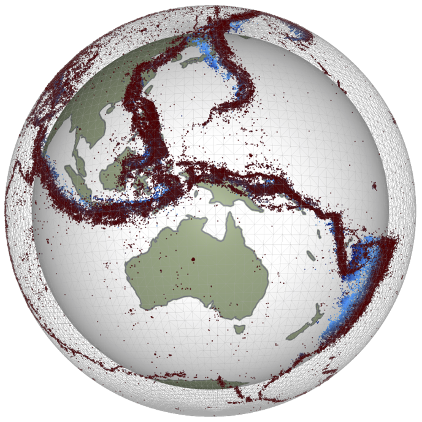
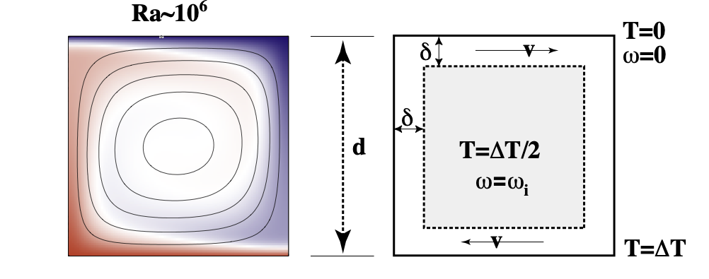
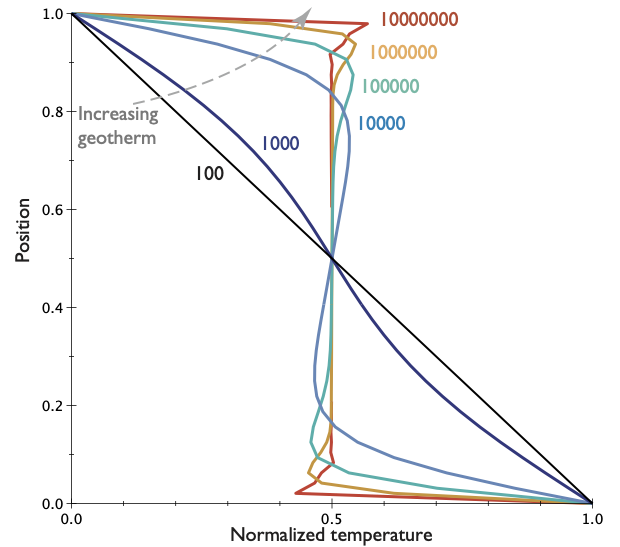
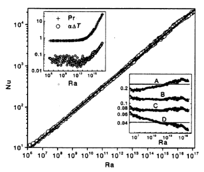
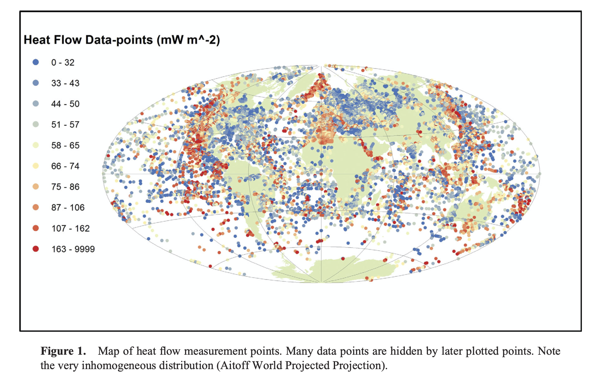
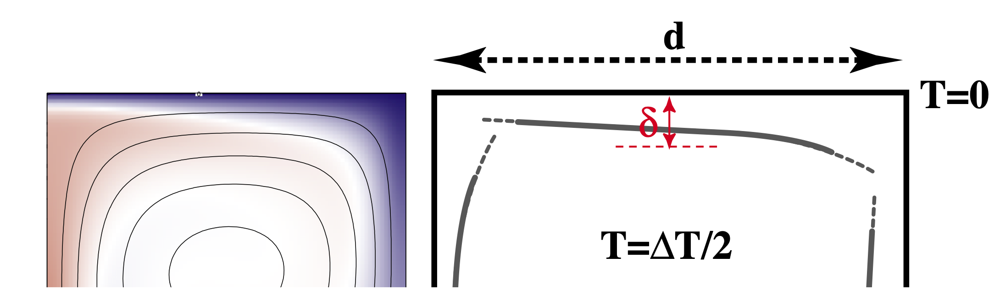
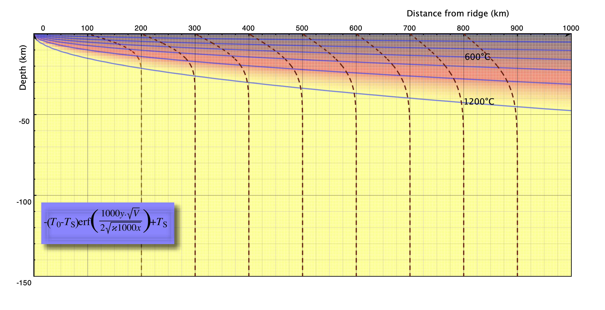

# EMSC 2022

## Mantle convection and plate motions (ii)

  - Louis Moresi, Australian National University

 <!-- .element style="float: right; width:30%" -->

 

*In which we concern ourselves with the observation of signals from the convecting mantle at the surface of the Earth and, perhaps, of the other terrestrial planets. We will see how mantle convection naturally
produces the pattern of heat flow in the oceans that we discussed in earlier lectures.*

<--o-->

## Observables

Quantitative information we can obtain about the dynamics of planetary interiors from remote sensing.

Which remote observations tell us what information ? 

  - **Gravity measurements**: density distribution
  - **Surface topography**: surface stress field
  - **Surface heat flow**: near surface temperature gradients
  - **Seismology**: elastic wave speed distribution
  - **Morphology**: deformation styles / relative ages
  - **E/M**: conductivity / magnetic susceptibility

None of these tells us directly what the flow is doing at depth —how to solve this and the uncertainty of rheological parameters.

<--o-->

## Recap from previous lecture

We assume the geometry of fully developed convection is as follows
  - Thin horizontal boundary layers where heat diffuses into the layer and is carried away by horizontal advection. 
  - These are connected by vertical boundary layers of similar dimension.
  - Approximately isothermal core, passively rotating, driven by the boundary layers.

 <!-- .element style="height:200px;" -->

Making all of these assumptions allows us to derive the relationships: 

$$ \mathrm{Nu} \propto \mathrm{Ra}^{1/3}  \quad \quad \textrm{and}  \quad \quad  \mathrm{V}_\mathrm{mean} \propto \mathrm{Ra}^{2/3} $$

<--v-->

## Recap from previous lecture

We saw that the we could predict the global heat flow by understanding the basic fluid dynamics of the convecting mantle. **How can we verify if our theoretical picture has anything to do with the real Earth ?**

 <!-- .element style="height:300px; " -->
 <!-- .element style="height:300px; "-->

We might try to look at the global heat flow to see if the numbers match, but, if we want to identify the convection patterns as well, we might need to look at variations in the heat flow.(e.g. can we see cold and hot regions ?). The problem is … 

<--o-->

## Global Heat Flow

 <!-- .element style="height:500px; " -->

Raw data compiled by Davies & Davies 2013. *There are really not very many reliable measurements*.

<--o-->

## Boundary Layer Theory

 <!-- .element style="height:300px; " -->

We can look a little bit harder at the convection model we have been using and try to take it one step further.

Consider what actually happens as the hot material arrives at the surface (on the left) and spreads out horizontally (to the right). It begins to cool off as it moves. Because the horizontal length scale of the boundary layer is larger than the vertical scale, this is almost like a 1d problem. 

<--o-->

## Boundary Layers and the Cooling 1/2 Space

Needs to be redrawn (better than before)

<--o-->

## Cooling lithosphere = Error Function

If we take a uniformly hot region and suddenly cool the boundary, the equation for the temperature as a function of time and space is:

$$ \frac{T-T_s}{T_0-T_s}  = \mathrm{erf} \left(  \frac{z}{2\sqrt{\kappa t}} \right) $$

*What is the erf  ?* -  It comes from probability theory and describes the probability of a value in a gaussian distribution having a value between -x and x. It might be hard to calculate, but it is easy enough to differentiate:

$$\textrm{erf}(x) = \int_{-x}^{x} e^{-t^2} dt $$

See https://en.wikipedia.org/wiki/Error_function for a discussion. 

<--v-->

## Cooling lithosphere = Error Function

</video>
<video autoplay controls loop height="400">
    <source src="movies/OceanCooling2.mov"
            type="video/mp4">

    Sorry, your browser doesn't support embedded videos.
</video>

Any point riding along with the plate sees a 1D cooling pattern underneath associated with the aging of the plate. This is a good approximation because lateral heat flow is small (small temperature gradients)

<--o-->

## Cooling Lithosphere: structure

 <!-- .element style="height:400px; " -->

Lithosphere / boundary layer thickness — pick an isotherm and follow it from ridge to trench.
Thickness $\delta$ changes systematically:

$$ \delta \propto \sqrt{\kappa t} \quad \quad \textrm{a.k.a} \quad \quad  \delta \propto \sqrt{\kappa x / V} $$

