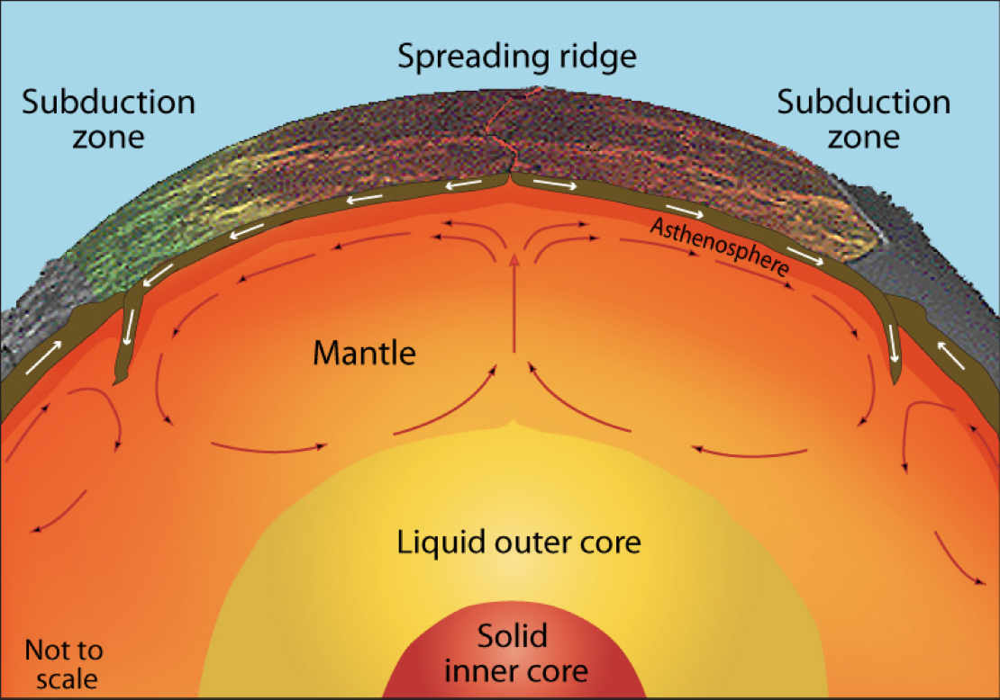

# EMSC 2022

## Mantle convection and plate motions

  - Louis Moresi, Australian National University

 <!-- .element style="float: right; width:30%" -->

<div style="width: 60%">

</br>

*In which we shall examine the nature of convection as a phenomenon that transfers heat and generates motion. We will see how we can extract a single number that tells us almost everything about how / whether convection takes place … and we will calculate this for the Earth’s mantle.*

</div>

---

## Mantle Convection

Convection in Earth’s interior is (a little bit) like a boiling pot (as we saw in a previous lecture)

<center>

  <!-- .element style="height:300px" -->
             <!-- .element style="height:300px" -->

</center>

The hot soup rises to the surface, spreads and begins to cool, and then sinks back to the bottom of the pot where it is reheated and rises again. **Why does hot soup rise and cold soup sink** ?

---

## General Observations on Convection

Without being particularly quantitative:


<div style="width:100%">


  - Hot liquid is more buoyant than cold material **and it tends to rise**
  - Cooler liquid is less buoyant and **therefore tends to sink**
  - This can only happen if the two can **move past each other**
  - Convection produces a self-stirring

</div>

  <!-- .element style="float:right; width:25%" -->

Buoyancy forces are at work and viscous forces counteract these forces once the fluid is moving

$$
\textrm{buoyancy} \propto g \rho_0 \alpha(1-\Delta T)
$$

Convection like this will only work when the soup is heated from below or, in the case of the Earth, if it is heated from within by radioactivity. **( Can you see why ?)**

---

## General Observations on Convection

**Definition**:  Convection is the transfer of heat by the self-organised movement of a fluid. Free convection is when the fluid is stirred entirely by rising buoyant material and sinking negatively-buoyant material. (Forced convection is produced when the fluid is stirred mechanically).

<center>

  <!-- .element style="width:25%" -->

</center>

Convection is one of the ways we transfer heat from hot regions to cold regions. Other ways that heat can be transferred include *radiation* and *conduction*. 

---


## Heat Transfer by Conduction

**Definition**: Conduction is the transfer of heat (or electric current) from one substance to another by direct contact (lattice vibrations / electrons). The transfer is always from a higher temperature to a lower temperature. Denser substances are usually better conductors; metals are excellent conductors. 


  <!-- .element style="width:25%" -->


<div style="width:60%">

$$
  Q=-\frac{k A \Delta T}{L}
$$

abc

</div>


--- 


## Resources

  <!-- .element style="float: right" width="25%" -->

<div style="width: 60%">

  [Online book](https://anu-rses-education.github.io/EMSC-3002/FrontPage.html)
with lecture materials, practicals and live computational examples.

  Wattle (when available), Programs and Courses  

  [Source code](https://github.com/underworld-geodynamics-cloud/self-managing-jupyterhub)
</div> 
---

## Learning Outcomes

 - one
 - two 
 - three

---

## Lecturers

LM
RB
CJ

Note: Short Bio for each of us. 


---

## Image 

 <!-- .element width="30%"  --> 
 <!-- .element width="30%"  --> 


---

## Image v2 

For full control on the image, including the ability to use `reveal.js` 
container sizing etc, you can use `html`


```html

```

That is all

--- 

---


## New Slide

With nothing much 

---

## Image v3


 <!-- .element style="float: right" width="40%" -->

A great deal of text, written hastily into which 
we would like to float an image somewhere to the right. Will
it float ?

A great deal of text, written hastily into which 
we would like to float an image somewhere to the right. Will
it float ?

A great deal of text, written hastily into which 
we would like to float an image somewhere to the right. Will
it float ?


---

